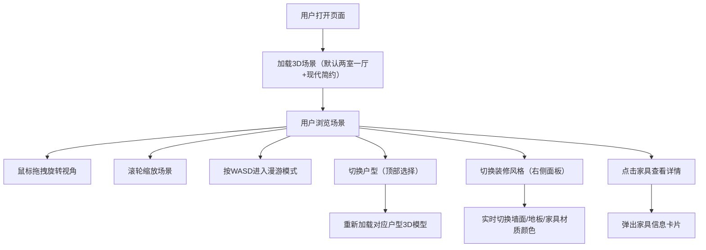

## 1. 产品概述

3D装修效果展示平台，专为装修公司打造的客户方案展示工具。用户可在浏览器中沉浸式浏览3D户型，实时切换装修风格，直观对比不同设计方案的效果。

- 核心价值：将抽象的装修设计方案转化为可交互、可漫游的3D实景，大幅提升客户沟通效率和方案转化率
- 目标用户：装修公司设计师、销售顾问、潜在客户

## 2. 核心功能

### 2.1 功能模块
1. **3D场景展示**：标准户型3D建模，包含客厅、卧室、厨房、卫生间，支持自由旋转缩放
2. **第一人称漫游**：WASD键走动，鼠标拖拽转视角，沉浸式空间体验
3. **风格切换面板**：现代简约、北欧风、新中式三种风格一键切换
4. **户型切换**：两室一厅、三室一厅两种户型方案
5. **家具交互**：点击家具弹出详情卡片（名称、尺寸、材质说明）

### 2.2 页面详情

| 页面名称 | 模块名称 | 功能描述 |
|---------|---------|----------|
| 主页面 | 3D场景区域 | Three.js渲染3D户型，占据屏幕主体，支持鼠标/键盘交互 |
| 主页面 | 顶部户型选择栏 | 切换"两室一厅"和"三室一厅"户型 |
| 主页面 | 右侧风格控制面板 | 风格选择按钮、当前风格预览、操作提示 |
| 主页面 | 家具信息卡片 | 点击家具后弹出，展示家具详细信息 |
| 主页面 | 漫游操作提示 | 左下角显示WASD+鼠标操作指引 |

## 3. 核心流程

## 4. 用户界面设计

### 4.1 设计风格
- **主色调**：深灰蓝（#1a2332）作为UI面板背景，营造专业沉稳的氛围
- **强调色**：暖金色（#d4a853）用于选中状态和品牌标识，传递品质感
- **辅助色**：柔和的中性灰系列用于文字和边框
- **按钮风格**：圆角矩形（8px），微玻璃拟态效果，悬浮时轻微上浮+发光
- **字体**：标题使用 Noto Serif SC（衬线，优雅），正文使用 Noto Sans SC（无衬线，易读）
- **布局风格**：3D场景全屏展示，UI面板采用浮动半透明设计，不遮挡场景
- **动效**：面板滑入滑出、材质切换渐变过渡、家具点击缩放反馈

### 4.2 页面设计

| 页面 | 模块 | UI元素 |
|-----|-----|--------|
| 主页面 | 3D场景 | 全屏WebGL画布，柔和环境光+定向光，阴影开启 |
| 主页面 | 顶部栏 | 半透明深色背景，左侧Logo，中间户型切换Tab，右侧帮助按钮 |
| 主页面 | 右侧面板 | 竖向排列风格卡片，每张含缩略预览、风格名称、描述，选中高亮 |
| 主页面 | 信息卡片 | 圆角卡片，含家具名称、尺寸、材质、风格标签，可关闭 |
| 主页面 | 操作提示 | 左下角半透明小卡片，展示键盘鼠标图标+操作说明 |

### 4.3 响应式
- 桌面端优先设计（1920×1080+）
- 平板端：右侧面板可折叠收起
- 移动端：简化为触控手势操作，面板置于底部

### 4.4 3D场景设计
- **环境**：柔和HDRI环境光，模拟室内自然采光
- **灯光**：主光源（模拟窗外日光）+ 补光（室内照明）+ 环境光（全局漫反射）
- **相机**：初始使用OrbitControls（轨道视角），按WASD自动切换为第一人称视角
- **构图**：初始相机位于客厅中心稍高处，45°俯瞰整个空间
- **交互**：材质切换使用颜色渐变过渡（300ms），家具切换带缩放动画
- **后期**：开启轻微抗锯齿和环境光遮蔽(SSAO)提升画面质感
