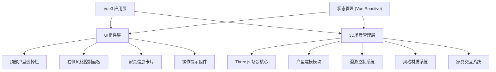

## 1. 架构设计



## 2. 技术说明

- **前端框架**：Vue 3 + TypeScript + Vite
- **3D渲染**：Three.js
- **样式方案**：Tailwind CSS 3
- **状态管理**：Vue 3 Composition API (reactive/ref)
- **项目初始化工具**：Vite (vue-ts模板)

## 3. 路由定义

| 路由 | 用途 |
|-----|------|
| / | 主页面 - 3D装修展示场景 |

## 4. 核心数据模型

### 4.1 户型数据结构
```typescript
interface FloorPlan {
  id: string
  name: string
  description: string
  rooms: Room[]
}

interface Room {
  id: string
  type: 'living' | 'bedroom' | 'kitchen' | 'bathroom'
  name: string
  position: { x: number; z: number }
  size: { width: number; depth: number; height: number }
}
```

### 4.2 装修风格数据结构
```typescript
interface DesignStyle {
  id: 'modern' | 'nordic' | 'chinese'
  name: string
  description: string
  previewColor: string
  materials: {
    wall: { color: string; roughness?: number }
    floor: { color: string; roughness?: number; metalness?: number }
    ceiling: { color: string }
  }
  furniture: FurnitureConfig[]
}

interface FurnitureConfig {
  id: string
  name: string
  type: 'sofa' | 'bed' | 'table' | 'cabinet' | 'chair'
  roomId: string
  position: { x: number; y: number; z: number }
  rotation: { x: number; y: number; z: number }
  size: { width: number; height: number; depth: number }
  color: string
  material: string
  dimensions: string
}
```

### 4.3 应用状态
```typescript
interface AppState {
  currentFloorPlan: string
  currentStyle: string
  selectedFurniture: FurnitureConfig | null
  isFirstPersonMode: boolean
  cameraPosition: { x: number; y: number; z: number }
}
```

## 5. 项目目录结构

```
src/
├── components/
│   ├── TopBar.vue              # 顶部户型选择栏
│   ├── StylePanel.vue          # 右侧风格控制面板
│   ├── FurnitureCard.vue       # 家具信息卡片
│   └── ControlHint.vue         # 操作提示组件
├── composables/
│   ├── useThreeScene.ts        # Three.js场景初始化与管理
│   ├── useFloorPlan.ts         # 户型建模与切换
│   ├── useFirstPerson.ts       # 第一人称漫游控制
│   ├── useStyleManager.ts      # 风格材质管理
│   └── useFurniture.ts         # 家具生成与交互
├── data/
│   ├── floorPlans.ts           # 户型数据
│   └── styles.ts               # 装修风格数据
├── types/
│   └── index.ts                # TypeScript类型定义
├── App.vue                     # 主应用组件
├── main.ts                     # 入口文件
└── style.css                   # 全局样式
```

## 6. 关键技术实现

### 6.1 Three.js场景管理
- 使用单例模式管理Scene、Camera、Renderer
- 统一的渲染循环(requestAnimationFrame)
- 响应式窗口大小调整

### 6.2 第一人称控制
- 基于PointerLock API实现鼠标视角控制
- WASD键盘移动，带简单碰撞检测（墙体阻挡）
- 相机高度模拟人眼高度（约1.6米）

### 6.3 风格切换
- 预计算所有风格的材质配置
- 切换时使用material.color.lerp()实现颜色平滑过渡
- 家具采用Group管理，切换时整体替换

### 6.4 家具交互
- Raycaster射线检测鼠标点击
- 点击后高亮选中家具（轻微放大+发光边框）
- 显示信息卡片，卡片位置跟随屏幕坐标转换
